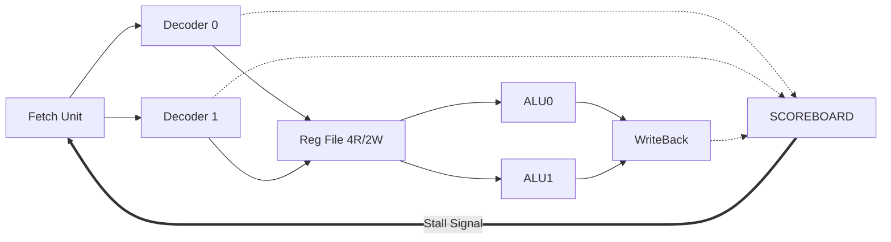

# 🚀 Dual-Issue Superscalar Processor with Scoreboarding

A synthesizable **Dual-Issue Superscalar Processor** designed in Verilog. This processor breaks the traditional scalar limit by fetching, decoding, and executing two instructions per clock cycle, controlled by a dynamic **Scoreboard** for hazard management.

---

## 📖 Table of Contents
- [About the Project](#-about-the-project)
- [Why This Is Needed](#-why-this-is-needed)
- [Key Features](#-key-features)
- [Architecture Overview](#-architecture-overview)
- [Prerequisites & Installation](#-prerequisites--installation)
- [How to Run](#-how-to-run)
- [Test Scenarios](#-test-scenarios)
- [Project Structure](#-project-structure)

---

## 🧐 About the Project

This project implements a 32-bit RISC-style processor capable of **Instruction Level Parallelism (ILP)**. Unlike standard processors that execute one instruction after another, this design features two parallel execution pipelines (Slot 0 and Slot 1).

To ensure data integrity during parallel execution, we implemented a **Scoreboard**. This unit acts as a "traffic cop," monitoring register usage and stalling specific pipeline stages only when a Data Hazard (Read-After-Write) is detected.

---

## ❓ Why This Is Needed

* **Breaking the "Flynn Limit":** Standard scalar processors have a maximum Instruction Per Cycle (IPC) of 1.0. To improve performance without just increasing clock speed (which causes heat), we need architecture that does more work per cycle.
* **Dynamic Scheduling:** Static scheduling (compiler-based) isn't always enough. Hardware-based Scoreboarding allows the processor to handle dependencies dynamically at runtime.
* **High-Performance Computing:** This architecture mimics the fundamental logic found in modern high-performance CPUs (like Intel Core or AMD Ryzen) used for parallel tasks.

---

## ✨ Key Features

* **Dual-Issue Logic:** Fetches and Decodes 2 instructions simultaneously (PC + 8).
* **Dynamic Scoreboarding:** Tracks "Busy Bits" for all 32 registers to prevent RAW hazards.
* **Parallel ALUs:** Two arithmetic logic units operating concurrently.
* **Multi-Ported Register File:** Custom design with **4 Read Ports** and **2 Write Ports** to support dual pipelines.
* **IPC of 2.0:** Achieves 2x speedup on independent instruction streams (verified via Vector Addition testbench).

---

## 🏗 Architecture Overview



---

## 🛠 Prerequisites & Installation

To simulate this project, you need Icarus Verilog (compiler) and GTKWave (waveform viewer).

### 🍎 For macOS (using Homebrew)

```bash
brew install iverilog
brew install --cask gtkwave
```

### 🐧 For Linux (Ubuntu/Debian)

```bash
sudo apt-get update
sudo apt-get install iverilog gtkwave
```

### 🪟 For Windows

1. Download the installer from [bleyer.org/icarus](http://bleyer.org/icarus).
2. **Important:** During installation, check the box "Add executable to PATH".
3. Install VS Code extensions: "Verilog-HDL/SystemVerilog" and "WaveTrace" (optional, for viewing waveforms inside VS Code).

---

## 🚀 How to Run

Follow these steps to compile and simulate the processor using the provided testbench.

### 1. Clone the Repository

```bash
git clone https://github.com/yourusername/dual-issue-processor.git
cd dual-issue-processor
```

### 2. Compile the Verilog Files

We use `iverilog` to link all modules together. Run this command in your terminal:

```bash
iverilog -o cpu_sim tb_top_processor.v top_processor.v fetch_decode.v scoreboard.v execute_stage.v memory_wb_stage.v reg_file_4r2w.v
```

### 3. Run the Simulation

Execute the compiled simulation file:

```bash
vvp cpu_sim
```

**Expected Output:** You should see logs indicating the parallel execution of instructions:

```
--- Start: Multi-Stall & Heavy Calculation Test ---
[SCOREBOARD] Time=35000 | Setting Busy[ 1]
...
Time=155000 | PC=80 | Result A: 11 | Result B: 22  <-- Parallel Result!
Time=165000 | PC=88 | Result A: 33 | Result B: 44  <-- Parallel Result!
```

### 4. View the Waveforms

To see the signals, logic levels, and stalls visually:

```bash
gtkwave tb_top.vcd
```

If you are using the "WaveTrace" extension in VS Code, simply click the `tb_top.vcd` file in the file explorer.

---

## 🧪 Test Scenarios

The `tb_top_processor.v` file includes a Hybrid Testbench that validates two critical behaviors:

### Safety Test (The Stall):
- Writes to registers x1 and x2.
- Immediately tries to read them.
- **Result:** Scoreboard asserts `stall_D`, proving hazard detection works.

### Speed Test (Parallel Vector Addition):
- Loads Arrays A and B.
- Executes `C[i] = A[i] + B[i]` and `C[i+1] = A[i+1] + B[i+1]` simultaneously.
- **Result:** Results appear in pairs, proving IPC = 2.0.

---

## 📂 Project Structure

```
├── top_processor.v       # Top-level module connecting all stages
├── fetch_decode.v        # Front-end (PC, IMEM, Dual Decoders)
├── scoreboard.v          # Hazard detection logic & Busy Vector
├── execute_stage.v       # Dual ALUs & Pipeline Registers
├── memory_wb_stage.v     # Memory access & Write-Back logic
├── reg_file_4r2w.v       # Multi-ported Register File (4 Read, 2 Write)
└── tb_top_processor.v    # Testbench (Simulation script)
```

---

## 🤝 Contributing

Contributions, issues, and feature requests are welcome! Feel free to check the [issues page](https://github.com/abhimnyu09/Design-and-Implementation-of-a-Dual-Issue-Superscalar-Processor-with-Scoreboarding).

---

## ⭐ Show Your Support

Give a ⭐️ if this project helped you learn about superscalar processors!

---

## 📧 Contact

For questions or suggestions, please open an issue or reach out via email.
